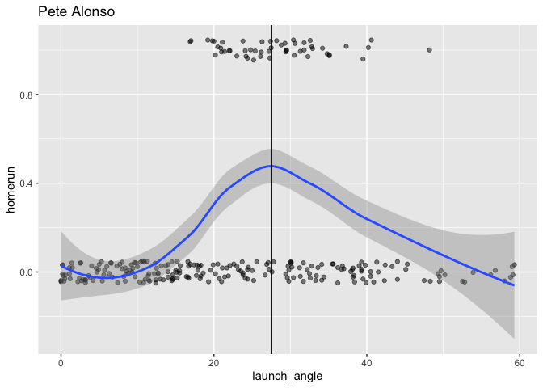
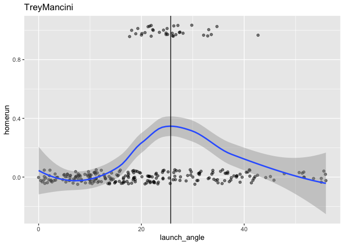
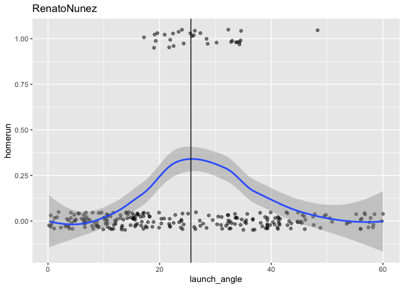
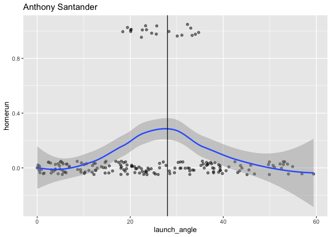

HR\_Probability\_Orioles
================

``` r
library(dplyr)
```

    ## 
    ## Attaching package: 'dplyr'

    ## The following objects are masked from 'package:stats':
    ## 
    ##     filter, lag

    ## The following objects are masked from 'package:base':
    ## 
    ##     intersect, setdiff, setequal, union

``` r
library(ggplot2)
library(broom)
```

``` r
#Importing CSV of Baseball Savant Data for ABs in 2019

PeteAlonso <- read.csv("PeteAlonso.csv", header = T)
TreyMancini <- read.csv("TreyMancini.csv", header = T)
RenatoNunez <- read.csv("RenatoNunez.csv", header = T)
AnthonySantander <- read.csv("AnthonySantander.csv", header = T)
```

``` r
#Adding ESPN's Park Factor Value to the data based on stadium of at-bat
PeteAlonso$park_factor <- ifelse(PeteAlonso$home_team == "COL", 1.394, 
       ifelse(PeteAlonso$home_team == "TEX", 1.245,
              ifelse(PeteAlonso$home_team == "DET", 1.107,
                     ifelse(PeteAlonso$home_team == "WSH", 1.101,
                            ifelse(PeteAlonso$home_team == "BAL", 1.088,
                                   ifelse(PeteAlonso$home_team == "MIA", 1.087,
                                          ifelse(PeteAlonso$home_team == "HOU", 1.083,
        ifelse(PeteAlonso$home_team == "KC", 1.074,
               ifelse(PeteAlonso$home_team == "BOS", 1.063,
                      ifelse(PeteAlonso$home_team == "PHI", 1.047,
                             ifelse(PeteAlonso$home_team == "CIN", 1.038,
                                    ifelse(PeteAlonso$home_team == "TOR", 1.031,
                                           ifelse(PeteAlonso$home_team == "LAA", 1.018,
        ifelse(PeteAlonso$home_team == "PIT", 1.004,
               ifelse(PeteAlonso$home_team == "ATL", 1.003,
                   ifelse(PeteAlonso$home_team == "ARI", 0.977,  
                          ifelse(PeteAlonso$home_team == "MIL", 0.976,
                                 ifelse(PeteAlonso$home_team == "MIN", 0.975,
                                        ifelse(PeteAlonso$home_team == "CLE", 0.972,
        ifelse(PeteAlonso$home_team == "CWS", 0.966,
               ifelse(PeteAlonso$home_team == "SEA", 0.952,
                      ifelse(PeteAlonso$home_team == "CHC", 0.931,
                             ifelse(PeteAlonso$home_team == "STL", 0.917,
                                    ifelse(PeteAlonso$home_team == "LAD", 0.905,
                                           ifelse(PeteAlonso$home_team == "TB", 0.895,
        ifelse(PeteAlonso$home_team == "NYM", 0.891,
               ifelse(PeteAlonso$home_team == "OAK", 0.887,
                      ifelse(PeteAlonso$home_team == "SD", 0.860,
                             ifelse(PeteAlonso$home_team == "NYY", 0.816,
                                    ifelse(PeteAlonso$home_team == "SF", 0.798,
              0.00))))))))))))))))))))))))))))))

TreyMancini$park_factor <- ifelse(TreyMancini$home_team == "COL", 1.394, 
       ifelse(TreyMancini$home_team == "TEX", 1.245,
              ifelse(TreyMancini$home_team == "DET", 1.107,
                     ifelse(TreyMancini$home_team == "WSH", 1.101,
                            ifelse(TreyMancini$home_team == "BAL", 1.088,
                                   ifelse(TreyMancini$home_team == "MIA", 1.087,
                                          ifelse(TreyMancini$home_team == "HOU", 1.083,
        ifelse(TreyMancini$home_team == "KC", 1.074,
               ifelse(TreyMancini$home_team == "BOS", 1.063,
                      ifelse(TreyMancini$home_team == "PHI", 1.047,
                             ifelse(TreyMancini$home_team == "CIN", 1.038,
                                    ifelse(TreyMancini$home_team == "TOR", 1.031,
                                           ifelse(TreyMancini$home_team == "LAA", 1.018,
        ifelse(TreyMancini$home_team == "PIT", 1.004,
               ifelse(TreyMancini$home_team == "ATL", 1.003,
                   ifelse(TreyMancini$home_team == "ARI", 0.977,  
                          ifelse(TreyMancini$home_team == "MIL", 0.976,
                                 ifelse(TreyMancini$home_team == "MIN", 0.975,
                                        ifelse(TreyMancini$home_team == "CLE", 0.972,
        ifelse(TreyMancini$home_team == "CWS", 0.966,
               ifelse(TreyMancini$home_team == "SEA", 0.952,
                      ifelse(TreyMancini$home_team == "CHC", 0.931,
                             ifelse(TreyMancini$home_team == "STL", 0.917,
                                    ifelse(TreyMancini$home_team == "LAD", 0.905,
                                           ifelse(TreyMancini$home_team == "TB", 0.895,
        ifelse(TreyMancini$home_team == "NYM", 0.891,
               ifelse(TreyMancini$home_team == "OAK", 0.887,
                      ifelse(TreyMancini$home_team == "SD", 0.860,
                             ifelse(TreyMancini$home_team == "NYY", 0.816,
                                    ifelse(TreyMancini$home_team == "SF", 0.798,
              0.00))))))))))))))))))))))))))))))

RenatoNunez$park_factor <- ifelse(RenatoNunez$home_team == "COL", 1.394, 
       ifelse(RenatoNunez$home_team == "TEX", 1.245,
              ifelse(RenatoNunez$home_team == "DET", 1.107,
                     ifelse(RenatoNunez$home_team == "WSH", 1.101,
                            ifelse(RenatoNunez$home_team == "BAL", 1.088,
                                   ifelse(RenatoNunez$home_team == "MIA", 1.087,
                                      ifelse(RenatoNunez$home_team == "HOU", 1.083,
        ifelse(RenatoNunez$home_team == "KC", 1.074,
               ifelse(RenatoNunez$home_team == "BOS", 1.063,
                      ifelse(RenatoNunez$home_team == "PHI", 1.047,
                             ifelse(RenatoNunez$home_team == "CIN", 1.038,
                                    ifelse(RenatoNunez$home_team == "TOR", 1.031,
                                     ifelse(RenatoNunez$home_team == "LAA", 1.018,
        ifelse(RenatoNunez$home_team == "PIT", 1.004,
               ifelse(RenatoNunez$home_team == "ATL", 1.003,
                   ifelse(RenatoNunez$home_team == "ARI", 0.977,  
                          ifelse(RenatoNunez$home_team == "MIL", 0.976,
                                 ifelse(RenatoNunez$home_team == "MIN", 0.975,
                                      ifelse(RenatoNunez$home_team == "CLE", 0.972,
        ifelse(RenatoNunez$home_team == "CWS", 0.966,
               ifelse(RenatoNunez$home_team == "SEA", 0.952,
                      ifelse(RenatoNunez$home_team == "CHC", 0.931,
                             ifelse(RenatoNunez$home_team == "STL", 0.917,
                                    ifelse(RenatoNunez$home_team == "LAD", 0.905,
                                        ifelse(RenatoNunez$home_team == "TB", 0.895,
        ifelse(RenatoNunez$home_team == "NYM", 0.891,
               ifelse(RenatoNunez$home_team == "OAK", 0.887,
                      ifelse(RenatoNunez$home_team == "SD", 0.860,
                             ifelse(RenatoNunez$home_team == "NYY", 0.816,
                                    ifelse(RenatoNunez$home_team == "SF", 0.798,
              0.00))))))))))))))))))))))))))))))

AnthonySantander$park_factor <- ifelse(AnthonySantander$home_team == "COL", 1.394, 
       ifelse(AnthonySantander$home_team == "TEX", 1.245,
              ifelse(AnthonySantander$home_team == "DET", 1.107,
                     ifelse(AnthonySantander$home_team == "WSH", 1.101,
                            ifelse(AnthonySantander$home_team == "BAL", 1.088,
                                   ifelse(AnthonySantander$home_team == "MIA", 1.087,
                                      ifelse(AnthonySantander$home_team == "HOU", 1.083,
        ifelse(AnthonySantander$home_team == "KC", 1.074,
               ifelse(AnthonySantander$home_team == "BOS", 1.063,
                      ifelse(AnthonySantander$home_team == "PHI", 1.047,
                             ifelse(AnthonySantander$home_team == "CIN", 1.038,
                                    ifelse(AnthonySantander$home_team == "TOR", 1.031,
                                     ifelse(AnthonySantander$home_team == "LAA", 1.018,
        ifelse(AnthonySantander$home_team == "PIT", 1.004,
               ifelse(AnthonySantander$home_team == "ATL", 1.003,
                   ifelse(AnthonySantander$home_team == "ARI", 0.977,  
                          ifelse(AnthonySantander$home_team == "MIL", 0.976,
                                 ifelse(AnthonySantander$home_team == "MIN", 0.975,
                                      ifelse(AnthonySantander$home_team == "CLE", 0.972,
        ifelse(AnthonySantander$home_team == "CWS", 0.966,
               ifelse(AnthonySantander$home_team == "SEA", 0.952,
                      ifelse(AnthonySantander$home_team == "CHC", 0.931,
                             ifelse(AnthonySantander$home_team == "STL", 0.917,
                                    ifelse(AnthonySantander$home_team == "LAD", 0.905,
                                        ifelse(AnthonySantander$home_team == "TB", 0.895,
        ifelse(AnthonySantander$home_team == "NYM", 0.891,
               ifelse(AnthonySantander$home_team == "OAK", 0.887,
                      ifelse(AnthonySantander$home_team == "SD", 0.860,
                             ifelse(AnthonySantander$home_team == "NYY", 0.816,
                                    ifelse(AnthonySantander$home_team == "SF", 0.798,
              0.00))))))))))))))))))))))))))))))

#Creating Dummy Homerun Variable
PeteAlonso$homerun <- ifelse(PeteAlonso$events == "home_run", 1, 0)
TreyMancini$homerun <- ifelse(TreyMancini$events == "home_run", 1, 0)
RenatoNunez$homerun <- ifelse(RenatoNunez$events == "home_run", 1, 0)
AnthonySantander$homerun <- ifelse(AnthonySantander$events == "home_run", 1, 0)
```

``` r
#Data formatting

#Replacing nulls with NA
PeteAlonso$launch_angle[PeteAlonso$launch_angle == "null"] <- NA
PeteAlonso$launch_speed[PeteAlonso$launch_speed == "null"] <- NA
PeteAlonso$effective_speed[PeteAlonso$effective_speed == "null"] <- NA
PeteAlonso$release_spin_rate[PeteAlonso$release_spin_rate == "null"] <- NA
PeteAlonso$hit_distance_sc[PeteAlonso$hit_distance_sc == "null"] <- NA

#changing structure for analysis
PeteAlonso$launch_angle <- as.numeric(as.character(PeteAlonso$launch_angle))
PeteAlonso$launch_speed <- as.numeric(as.character(PeteAlonso$launch_speed))
PeteAlonso$effective_speed <- as.numeric(as.character(PeteAlonso$effective_speed))
PeteAlonso$release_spin_rate <- as.numeric(as.character(PeteAlonso$release_spin_rate))
PeteAlonso$hit_distance_sc <- as.numeric(as.character(PeteAlonso$hit_distance_sc))
```

``` r
#Logistic Regression models
#Standard Logistic Regression Model
glm_Alonso <- glm(homerun ~ launch_angle + launch_speed + effective_speed +   release_spin_rate + park_factor, data = PeteAlonso, family = binomial, na.action = na.exclude)
summary(glm_Alonso)
```

    ## 
    ## Call:
    ## glm(formula = homerun ~ launch_angle + launch_speed + effective_speed + 
    ##     release_spin_rate + park_factor, family = binomial, data = PeteAlonso, 
    ##     na.action = na.exclude)
    ## 
    ## Deviance Residuals: 
    ##      Min        1Q    Median        3Q       Max  
    ## -2.16037  -0.24013  -0.03769  -0.00170   2.69147  
    ## 
    ## Coefficients:
    ##                     Estimate Std. Error z value Pr(>|z|)    
    ## (Intercept)       -3.446e+01  6.055e+00  -5.691 1.26e-08 ***
    ## launch_angle       1.113e-01  1.967e-02   5.660 1.52e-08 ***
    ## launch_speed       3.100e-01  4.456e-02   6.957 3.47e-12 ***
    ## effective_speed    1.341e-02  3.401e-02   0.394    0.693    
    ## release_spin_rate -2.131e-04  6.231e-04  -0.342    0.732    
    ## park_factor       -2.568e+00  1.931e+00  -1.330    0.184    
    ## ---
    ## Signif. codes:  0 '***' 0.001 '**' 0.01 '*' 0.05 '.' 0.1 ' ' 1
    ## 
    ## (Dispersion parameter for binomial family taken to be 1)
    ## 
    ##     Null deviance: 312.60  on 398  degrees of freedom
    ## Residual deviance: 146.23  on 393  degrees of freedom
    ##   (193 observations deleted due to missingness)
    ## AIC: 158.23
    ## 
    ## Number of Fisher Scoring iterations: 8

``` r
#Improved Model using polynomial fitting for launch angle
#Some regressors aren't statisticall significant but I chose to keep them anyways
glm_Alonso2 <- glm(homerun ~ poly(launch_angle, 2, raw=TRUE) + launch_speed + effective_speed:release_spin_rate + park_factor, data = PeteAlonso, family = binomial, na.action = na.exclude)
```

    ## Warning: glm.fit: fitted probabilities numerically 0 or 1 occurred

``` r
summary(glm_Alonso2)
```

    ## 
    ## Call:
    ## glm(formula = homerun ~ poly(launch_angle, 2, raw = TRUE) + launch_speed + 
    ##     effective_speed:release_spin_rate + park_factor, family = binomial, 
    ##     data = PeteAlonso, na.action = na.exclude)
    ## 
    ## Deviance Residuals: 
    ##      Min        1Q    Median        3Q       Max  
    ## -2.06091  -0.01039   0.00000   0.00000   2.64852  
    ## 
    ## Coefficients:
    ##                                      Estimate Std. Error z value Pr(>|z|)    
    ## (Intercept)                        -7.051e+01  1.342e+01  -5.255 1.48e-07 ***
    ## poly(launch_angle, 2, raw = TRUE)1  1.858e+00  3.896e-01   4.770 1.84e-06 ***
    ## poly(launch_angle, 2, raw = TRUE)2 -2.992e-02  6.466e-03  -4.627 3.70e-06 ***
    ## launch_speed                        4.459e-01  8.138e-02   5.479 4.29e-08 ***
    ## park_factor                        -4.152e+00  3.079e+00  -1.349    0.177    
    ## effective_speed:release_spin_rate   8.735e-06  9.974e-06   0.876    0.381    
    ## ---
    ## Signif. codes:  0 '***' 0.001 '**' 0.01 '*' 0.05 '.' 0.1 ' ' 1
    ## 
    ## (Dispersion parameter for binomial family taken to be 1)
    ## 
    ##     Null deviance: 312.605  on 398  degrees of freedom
    ## Residual deviance:  62.472  on 393  degrees of freedom
    ##   (193 observations deleted due to missingness)
    ## AIC: 74.472
    ## 
    ## Number of Fisher Scoring iterations: 12

``` r
#Same model but with distance
glm_Alonso3 <- lm(hit_distance_sc ~ poly(launch_angle,2,raw=TRUE) + launch_speed + effective_speed:release_spin_rate + park_factor, data = PeteAlonso, na.action = na.exclude)

summary(glm_Alonso3)
```

    ## 
    ## Call:
    ## lm(formula = hit_distance_sc ~ poly(launch_angle, 2, raw = TRUE) + 
    ##     launch_speed + effective_speed:release_spin_rate + park_factor, 
    ##     data = PeteAlonso, na.action = na.exclude)
    ## 
    ## Residuals:
    ##     Min      1Q  Median      3Q     Max 
    ## -373.94  -76.57    6.55   72.92  437.32 
    ## 
    ## Coefficients:
    ##                                      Estimate Std. Error t value Pr(>|t|)    
    ## (Intercept)                        -1.801e+02  6.641e+01  -2.712  0.00700 ** 
    ## poly(launch_angle, 2, raw = TRUE)1  4.192e+00  2.546e-01  16.466  < 2e-16 ***
    ## poly(launch_angle, 2, raw = TRUE)2 -1.622e-02  5.499e-03  -2.950  0.00338 ** 
    ## launch_speed                        2.946e+00  3.613e-01   8.156 5.81e-15 ***
    ## park_factor                         2.454e+01  4.861e+01   0.505  0.61391    
    ## effective_speed:release_spin_rate   1.890e-04  1.639e-04   1.153  0.24947    
    ## ---
    ## Signif. codes:  0 '***' 0.001 '**' 0.01 '*' 0.05 '.' 0.1 ' ' 1
    ## 
    ## Residual standard error: 99.16 on 361 degrees of freedom
    ##   (225 observations deleted due to missingness)
    ## Multiple R-squared:  0.5835, Adjusted R-squared:  0.5777 
    ## F-statistic: 101.1 on 5 and 361 DF,  p-value: < 2.2e-16

``` r
#Filtering middle launch angle values
PeteAlonso_middle <- PeteAlonso %>%
  filter(launch_angle >= 0, launch_angle  <= 60)

# scatterplot with jitter
data_space <- ggplot(data = PeteAlonso_middle, aes(y = homerun, x = launch_angle)) + 
      geom_jitter(width = 0, height = 0.05, alpha = 0.5) + ggtitle("Pete Alonso") 
#smooth curve
 data_space +
  geom_smooth() + geom_vline(xintercept = 27.55)
```

    ## `geom_smooth()` using method = 'loess' and formula 'y ~ x'

<!-- -->

``` r
#We see highest point on geom_smooth curve occurs about launch angle = 27.55 degrees
```

``` r
# create new data frame with predictive data
#Used Aaron Nola's 2019 averages (4seam Fb) and Alsonso's average EV
#Saying it's at Citi Field for park factor
new_pitch_Nola <- data.frame(launch_angle = 27.55, launch_speed = 94.7, effective_speed = 89.7, release_spin_rate = 2171, park_factor = 0.891)

# make predictions on probability of a homerun on the given pitch at optimal launch #angle
augment(glm_Alonso2, newdata = new_pitch_Nola, type.predict = "response")
```

    ## # A tibble: 1 x 7
    ##   launch_angle launch_speed effective_speed release_spin_ra… park_factor .fitted
    ##          <dbl>        <dbl>           <dbl>            <dbl>       <dbl>   <dbl>
    ## 1         27.6         94.7            89.7             2171       0.891   0.143
    ## # … with 1 more variable: .se.fit <dbl>

``` r
# 0.1426
# make predictions on expected distance on the given pitch at optimal launch #angle
augment(glm_Alonso3, newdata = new_pitch_Nola, type.predict = "response")
```

    ## # A tibble: 1 x 7
    ##   launch_angle launch_speed effective_speed release_spin_ra… park_factor .fitted
    ##          <dbl>        <dbl>           <dbl>            <dbl>       <dbl>   <dbl>
    ## 1         27.6         94.7            89.7             2171       0.891    261.
    ## # … with 1 more variable: .se.fit <dbl>

``` r
#260.76 feet
```

``` r
#Confusion Matrix to see accuracy
tidy.Alonso <- augment(glm_Alonso2, type.predict = "response") %>%
    mutate(homerun.hat = round(.fitted))
```

    ## Warning in augment_columns(x, data, newdata, type.predict = type.predict, : When
    ## fitting with na.exclude, rows with NA in original data will be dropped unless
    ## those rows are provided in 'data' argument

``` r
tidy.Alonso %>%
  select(homerun, homerun.hat) %>%
  table()
```

    ##        homerun.hat
    ## homerun   0   1
    ##       0 342   4
    ##       1   5  48

``` r
#Data formatting

#Replacing nulls with NA
TreyMancini$launch_angle[TreyMancini$launch_angle == "null"] <- NA
TreyMancini$launch_speed[TreyMancini$launch_speed == "null"] <- NA
TreyMancini$effective_speed[TreyMancini$effective_speed == "null"] <- NA
TreyMancini$release_spin_rate[TreyMancini$release_spin_rate == "null"] <- NA
TreyMancini$hit_distance_sc[TreyMancini$hit_distance_sc == "null"] <- NA

#changing structure for analysis
TreyMancini$launch_angle <- as.numeric(as.character(TreyMancini$launch_angle))
TreyMancini$launch_speed <- as.numeric(as.character(TreyMancini$launch_speed))
TreyMancini$effective_speed <- as.numeric(as.character(TreyMancini$effective_speed))
TreyMancini$release_spin_rate <- as.numeric(as.character(TreyMancini$release_spin_rate))
TreyMancini$hit_distance_sc <- as.numeric(as.character(TreyMancini$hit_distance_sc))
```

``` r
#Standard Logistic model 
glm_Mancini <- glm(homerun ~ launch_angle + launch_speed + effective_speed + release_spin_rate + park_factor, data = TreyMancini, family = binomial, na.action = na.exclude)
summary(glm_Mancini)
```

    ## 
    ## Call:
    ## glm(formula = homerun ~ launch_angle + launch_speed + effective_speed + 
    ##     release_spin_rate + park_factor, family = binomial, data = TreyMancini, 
    ##     na.action = na.exclude)
    ## 
    ## Deviance Residuals: 
    ##      Min        1Q    Median        3Q       Max  
    ## -2.15077  -0.24225  -0.03915  -0.00365   2.39675  
    ## 
    ## Coefficients:
    ##                     Estimate Std. Error z value Pr(>|z|)    
    ## (Intercept)       -3.629e+01  7.789e+00  -4.660 3.17e-06 ***
    ## launch_angle       1.018e-01  2.019e-02   5.042 4.61e-07 ***
    ## launch_speed       3.012e-01  5.252e-02   5.735 9.75e-09 ***
    ## effective_speed    4.422e-02  4.751e-02   0.931    0.352    
    ## release_spin_rate -4.157e-04  9.390e-04  -0.443    0.658    
    ## park_factor       -1.533e+00  2.257e+00  -0.679    0.497    
    ## ---
    ## Signif. codes:  0 '***' 0.001 '**' 0.01 '*' 0.05 '.' 0.1 ' ' 1
    ## 
    ## (Dispersion parameter for binomial family taken to be 1)
    ## 
    ##     Null deviance: 245.65  on 447  degrees of freedom
    ## Residual deviance: 139.38  on 442  degrees of freedom
    ##   (154 observations deleted due to missingness)
    ## AIC: 151.38
    ## 
    ## Number of Fisher Scoring iterations: 8

``` r
#Improved Model using polynomial fitting for launch angle
#Some regressors were highly insignificant so I chose to remove them from model 
glm_Mancini2 <- glm(homerun ~ poly(launch_angle, 2, raw=TRUE) + launch_speed, data = TreyMancini, family = binomial, na.action = na.exclude)
```

    ## Warning: glm.fit: fitted probabilities numerically 0 or 1 occurred

``` r
summary(glm_Mancini2)
```

    ## 
    ## Call:
    ## glm(formula = homerun ~ poly(launch_angle, 2, raw = TRUE) + launch_speed, 
    ##     family = binomial, data = TreyMancini, na.action = na.exclude)
    ## 
    ## Deviance Residuals: 
    ##     Min       1Q   Median       3Q      Max  
    ## -2.1651  -0.0158   0.0000   0.0000   3.4999  
    ## 
    ## Coefficients:
    ##                                     Estimate Std. Error z value Pr(>|z|)    
    ## (Intercept)                        -70.27944   13.24504  -5.306 1.12e-07 ***
    ## poly(launch_angle, 2, raw = TRUE)1   1.89682    0.43258   4.385 1.16e-05 ***
    ## poly(launch_angle, 2, raw = TRUE)2  -0.03264    0.00789  -4.137 3.52e-05 ***
    ## launch_speed                         0.42933    0.08808   4.874 1.09e-06 ***
    ## ---
    ## Signif. codes:  0 '***' 0.001 '**' 0.01 '*' 0.05 '.' 0.1 ' ' 1
    ## 
    ## (Dispersion parameter for binomial family taken to be 1)
    ## 
    ##     Null deviance: 247.420  on 458  degrees of freedom
    ## Residual deviance:  75.805  on 455  degrees of freedom
    ##   (143 observations deleted due to missingness)
    ## AIC: 83.805
    ## 
    ## Number of Fisher Scoring iterations: 12

``` r
#Same model but with distance
glm_Mancini3 <- lm(hit_distance_sc ~ poly(launch_angle,2,raw=TRUE) + launch_speed, data = TreyMancini, na.action = na.exclude)

summary(glm_Mancini3)
```

    ## 
    ## Call:
    ## lm(formula = hit_distance_sc ~ poly(launch_angle, 2, raw = TRUE) + 
    ##     launch_speed, data = TreyMancini, na.action = na.exclude)
    ## 
    ## Residuals:
    ##     Min      1Q  Median      3Q     Max 
    ## -485.51  -60.24   -2.05   68.53  204.73 
    ## 
    ## Coefficients:
    ##                                      Estimate Std. Error t value Pr(>|t|)    
    ## (Intercept)                        -89.748208  29.039559  -3.091  0.00213 ** 
    ## poly(launch_angle, 2, raw = TRUE)1   4.316565   0.181758  23.749  < 2e-16 ***
    ## poly(launch_angle, 2, raw = TRUE)2   0.012912   0.005078   2.543  0.01135 *  
    ## launch_speed                         2.450622   0.307135   7.979 1.39e-14 ***
    ## ---
    ## Signif. codes:  0 '***' 0.001 '**' 0.01 '*' 0.05 '.' 0.1 ' ' 1
    ## 
    ## Residual standard error: 87.75 on 424 degrees of freedom
    ##   (174 observations deleted due to missingness)
    ## Multiple R-squared:  0.6561, Adjusted R-squared:  0.6537 
    ## F-statistic: 269.7 on 3 and 424 DF,  p-value: < 2.2e-16

``` r
#Filtering middle launch angle values
TreyMancini_middle <- TreyMancini %>%
  filter(launch_angle >= 0, launch_angle  <= 60)

# scatterplot with jitter
data_space <- ggplot(data = TreyMancini_middle, aes(y = homerun, x = launch_angle)) + 
      geom_jitter(width = 0, height = 0.05, alpha = 0.5) + ggtitle("TreyMancini") 
#smooth curve
 data_space +
  geom_smooth() + geom_vline(xintercept = 25.7)
```

    ## `geom_smooth()` using method = 'loess' and formula 'y ~ x'

<!-- -->

``` r
 #We see highest point on geom_smooth curve occurs about launch angle = 25.7 degrees
```

``` r
# create new data frame with predictive data
#Used Eduardo Rodriguez's 2019 averages (4seam Fb) and Mancini's average EV
#Assume game played at Camden Yards
new_pitch_Rodriguez <- data.frame(launch_angle = 27.5, launch_speed = 93.6, effective_speed = 88, release_spin_rate = 2200, park_factor = 1.088)

# make predictions on probability of a homerun on the given pitch at optimal launch #angle
augment(glm_Mancini2, newdata = new_pitch_Rodriguez, type.predict = "response")
```

    ## # A tibble: 1 x 7
    ##   launch_angle launch_speed effective_speed release_spin_ra… park_factor .fitted
    ##          <dbl>        <dbl>           <dbl>            <dbl>       <dbl>   <dbl>
    ## 1         27.5         93.6              88             2200        1.09  0.0681
    ## # … with 1 more variable: .se.fit <dbl>

``` r
# 0.06814

# make predictions on expected distance on the given pitch at optimal launch #angle
augment(glm_Mancini3, newdata = new_pitch_Rodriguez, type.predict = "response")
```

    ## # A tibble: 1 x 7
    ##   launch_angle launch_speed effective_speed release_spin_ra… park_factor .fitted
    ##          <dbl>        <dbl>           <dbl>            <dbl>       <dbl>   <dbl>
    ## 1         27.5         93.6              88             2200        1.09    268.
    ## # … with 1 more variable: .se.fit <dbl>

``` r
#268.1 feet
```

``` r
#Confusion Matrix
tidy.Mancini <- augment(glm_Mancini2, type.predict = "response") %>%
    mutate(homerun.hat = round(.fitted))
```

    ## Warning in augment_columns(x, data, newdata, type.predict = type.predict, : When
    ## fitting with na.exclude, rows with NA in original data will be dropped unless
    ## those rows are provided in 'data' argument

``` r
tidy.Mancini %>%
  select(homerun, homerun.hat) %>%
  table()
```

    ##        homerun.hat
    ## homerun   0   1
    ##       0 415   9
    ##       1   9  26

``` r
#Data formatting

#Replacing nulls with NA
RenatoNunez$launch_angle[RenatoNunez$launch_angle == "null"] <- NA
RenatoNunez$launch_speed[RenatoNunez$launch_speed == "null"] <- NA
RenatoNunez$effective_speed[RenatoNunez$effective_speed == "null"] <- NA
RenatoNunez$release_spin_rate[RenatoNunez$release_spin_rate == "null"] <- NA
RenatoNunez$hit_distance_sc[RenatoNunez$hit_distance_sc == "null"] <- NA

#changing structure for analysis
RenatoNunez$launch_angle <- as.numeric(as.character(RenatoNunez$launch_angle))
RenatoNunez$launch_speed <- as.numeric(as.character(RenatoNunez$launch_speed))
RenatoNunez$effective_speed <- as.numeric(as.character(RenatoNunez$effective_speed))
RenatoNunez$release_spin_rate <- as.numeric(as.character(RenatoNunez$release_spin_rate))
RenatoNunez$hit_distance_sc <- as.numeric(as.character(RenatoNunez$hit_distance_sc))
```

``` r
#Logistic model 
glm_Nunez <- glm(homerun ~ launch_angle + launch_speed + effective_speed + release_spin_rate + park_factor, data = RenatoNunez, family = binomial, na.action = na.exclude)
```

    ## Warning: glm.fit: fitted probabilities numerically 0 or 1 occurred

``` r
summary(glm_Nunez)
```

    ## 
    ## Call:
    ## glm(formula = homerun ~ launch_angle + launch_speed + effective_speed + 
    ##     release_spin_rate + park_factor, family = binomial, data = RenatoNunez, 
    ##     na.action = na.exclude)
    ## 
    ## Deviance Residuals: 
    ##      Min        1Q    Median        3Q       Max  
    ## -2.68510  -0.09730  -0.01349  -0.00027   2.64841  
    ## 
    ## Coefficients:
    ##                     Estimate Std. Error z value Pr(>|z|)    
    ## (Intercept)       -5.109e+01  9.883e+00  -5.169 2.35e-07 ***
    ## launch_angle       1.486e-01  3.069e-02   4.841 1.29e-06 ***
    ## launch_speed       5.059e-01  8.776e-02   5.765 8.15e-09 ***
    ## effective_speed   -5.911e-02  4.004e-02  -1.476    0.140    
    ## release_spin_rate -1.435e-03  8.805e-04  -1.630    0.103    
    ## park_factor        1.332e+00  2.332e+00   0.571    0.568    
    ## ---
    ## Signif. codes:  0 '***' 0.001 '**' 0.01 '*' 0.05 '.' 0.1 ' ' 1
    ## 
    ## (Dispersion parameter for binomial family taken to be 1)
    ## 
    ##     Null deviance: 216.462  on 389  degrees of freedom
    ## Residual deviance:  82.116  on 384  degrees of freedom
    ##   (152 observations deleted due to missingness)
    ## AIC: 94.116
    ## 
    ## Number of Fisher Scoring iterations: 9

``` r
#Improved Model using polynomial fitting for launch angle
#All of the variables except park factor are significant, and park factor is pretty darn close
glm_Nunez2 <- glm(homerun ~ poly(launch_angle, 2, raw=TRUE) + launch_speed + effective_speed:release_spin_rate+ park_factor, data = RenatoNunez, family = binomial, na.action = na.exclude)
```

    ## Warning: glm.fit: fitted probabilities numerically 0 or 1 occurred

``` r
summary(glm_Nunez2)
```

    ## 
    ## Call:
    ## glm(formula = homerun ~ poly(launch_angle, 2, raw = TRUE) + launch_speed + 
    ##     effective_speed:release_spin_rate + park_factor, family = binomial, 
    ##     data = RenatoNunez, na.action = na.exclude)
    ## 
    ## Deviance Residuals: 
    ##      Min        1Q    Median        3Q       Max  
    ## -2.30383  -0.00348  -0.00001   0.00000   1.90360  
    ## 
    ## Coefficients:
    ##                                      Estimate Std. Error z value Pr(>|z|)    
    ## (Intercept)                        -9.360e+01  2.269e+01  -4.124 3.72e-05 ***
    ## poly(launch_angle, 2, raw = TRUE)1  1.670e+00  4.374e-01   3.818 0.000135 ***
    ## poly(launch_angle, 2, raw = TRUE)2 -2.595e-02  7.099e-03  -3.656 0.000256 ***
    ## launch_speed                        6.363e-01  1.576e-01   4.038 5.40e-05 ***
    ## park_factor                         7.308e+00  4.024e+00   1.816 0.069329 .  
    ## effective_speed:release_spin_rate  -2.679e-05  1.237e-05  -2.165 0.030355 *  
    ## ---
    ## Signif. codes:  0 '***' 0.001 '**' 0.01 '*' 0.05 '.' 0.1 ' ' 1
    ## 
    ## (Dispersion parameter for binomial family taken to be 1)
    ## 
    ##     Null deviance: 216.462  on 389  degrees of freedom
    ## Residual deviance:  38.619  on 384  degrees of freedom
    ##   (152 observations deleted due to missingness)
    ## AIC: 50.619
    ## 
    ## Number of Fisher Scoring iterations: 12

``` r
#Same model but with distance
glm_Nunez3 <- lm(hit_distance_sc ~ poly(launch_angle,2,raw=TRUE) + launch_speed + effective_speed:release_spin_rate + park_factor, data = RenatoNunez, na.action = na.exclude)

summary(glm_Nunez3)
```

    ## 
    ## Call:
    ## lm(formula = hit_distance_sc ~ poly(launch_angle, 2, raw = TRUE) + 
    ##     launch_speed + effective_speed:release_spin_rate + park_factor, 
    ##     data = RenatoNunez, na.action = na.exclude)
    ## 
    ## Residuals:
    ##     Min      1Q  Median      3Q     Max 
    ## -208.83  -73.32    9.90   62.39  426.81 
    ## 
    ## Coefficients:
    ##                                      Estimate Std. Error t value Pr(>|t|)    
    ## (Intercept)                         1.955e+01  6.837e+01   0.286   0.7751    
    ## poly(launch_angle, 2, raw = TRUE)1  4.142e+00  2.496e-01  16.591  < 2e-16 ***
    ## poly(launch_angle, 2, raw = TRUE)2 -3.271e-02  5.156e-03  -6.344 6.99e-10 ***
    ## launch_speed                        2.716e+00  3.708e-01   7.324 1.70e-12 ***
    ## park_factor                        -8.149e+01  4.786e+01  -1.703   0.0895 .  
    ## effective_speed:release_spin_rate  -1.339e-04  1.575e-04  -0.850   0.3960    
    ## ---
    ## Signif. codes:  0 '***' 0.001 '**' 0.01 '*' 0.05 '.' 0.1 ' ' 1
    ## 
    ## Residual standard error: 94.25 on 347 degrees of freedom
    ##   (189 observations deleted due to missingness)
    ## Multiple R-squared:  0.5357, Adjusted R-squared:  0.5291 
    ## F-statistic: 80.09 on 5 and 347 DF,  p-value: < 2.2e-16

``` r
#Filtering middle launch angle values
RenatoNunez_middle <- RenatoNunez %>%
  filter(launch_angle >= 0, launch_angle  <= 60)

# scatterplot with jitter
data_space <- ggplot(data = RenatoNunez_middle, aes(y = homerun, x = launch_angle)) + geom_jitter(width = 0, height = 0.05, alpha = 0.5) + 
  ggtitle("RenatoNunez")
#smooth curve
 data_space +
  geom_smooth() + geom_vline(xintercept = 25.6)
```

    ## `geom_smooth()` using method = 'loess' and formula 'y ~ x'

<!-- -->

``` r
  #We see highest homerun probability at LA of about 25.6 degrees
```

``` r
# create new data frame with predictive data
#Used Eduardo Rodriguez's 2019 averages (4seam Fb) and Nunez's average EV
#Assume game played at Camden Yards
new_pitch_Rodriguez <- data.frame(launch_angle = 25.6, launch_speed = 91.8, effective_speed = 88, release_spin_rate = 2200, park_factor = 1.088)

# make predictions on probability of a homerun on the given pitch at optimal launch #angle
augment(glm_Nunez2, newdata = new_pitch_Rodriguez, type.predict = "response")
```

    ## # A tibble: 1 x 7
    ##   launch_angle launch_speed effective_speed release_spin_ra… park_factor .fitted
    ##          <dbl>        <dbl>           <dbl>            <dbl>       <dbl>   <dbl>
    ## 1         25.6         91.8              88             2200        1.09 0.00126
    ## # … with 1 more variable: .se.fit <dbl>

``` r
# 0.00126

# make predictions on expected distance on the given pitch at optimal launch #angle
augment(glm_Nunez3, newdata = new_pitch_Rodriguez, type.predict = "response")
```

    ## # A tibble: 1 x 7
    ##   launch_angle launch_speed effective_speed release_spin_ra… park_factor .fitted
    ##          <dbl>        <dbl>           <dbl>            <dbl>       <dbl>   <dbl>
    ## 1         25.6         91.8              88             2200        1.09    239.
    ## # … with 1 more variable: .se.fit <dbl>

``` r
#238.88 feet
```

``` r
#Confusion Matrix
tidy.Nunez <- augment(glm_Nunez2, type.predict = "response") %>%
    mutate(homerun.hat = round(.fitted))
```

    ## Warning in augment_columns(x, data, newdata, type.predict = type.predict, : When
    ## fitting with na.exclude, rows with NA in original data will be dropped unless
    ## those rows are provided in 'data' argument

``` r
tidy.Nunez %>%
  select(homerun, homerun.hat) %>%
  table()
```

    ##        homerun.hat
    ## homerun   0   1
    ##       0 355   4
    ##       1   6  25

``` r
#Data formatting

#Replacing nulls with NA
AnthonySantander$launch_angle[AnthonySantander$launch_angle == "null"] <- NA
AnthonySantander$launch_speed[AnthonySantander$launch_speed == "null"] <- NA
AnthonySantander$effective_speed[AnthonySantander$effective_speed == "null"] <- NA
AnthonySantander$release_spin_rate[AnthonySantander$release_spin_rate == "null"] <- NA
AnthonySantander$hit_distance_sc[AnthonySantander$hit_distance_sc == "null"] <- NA

#changing structure for analysis
AnthonySantander$launch_angle <- as.numeric(as.character(AnthonySantander$launch_angle))
AnthonySantander$launch_speed <- as.numeric(as.character(AnthonySantander$launch_speed))
AnthonySantander$effective_speed <- as.numeric(as.character(AnthonySantander$effective_speed))
AnthonySantander$release_spin_rate <- as.numeric(as.character(AnthonySantander$release_spin_rate))
AnthonySantander$hit_distance_sc <- as.numeric(as.character(AnthonySantander$hit_distance_sc))
```

``` r
#Standard Logistic model 
glm_Santander <- glm(homerun ~ launch_angle + launch_speed + effective_speed +   release_spin_rate + park_factor, data = AnthonySantander, family = binomial, na.action = na.exclude)
```

    ## Warning: glm.fit: fitted probabilities numerically 0 or 1 occurred

``` r
summary(glm_Santander)
```

    ## 
    ## Call:
    ## glm(formula = homerun ~ launch_angle + launch_speed + effective_speed + 
    ##     release_spin_rate + park_factor, family = binomial, data = AnthonySantander, 
    ##     na.action = na.exclude)
    ## 
    ## Deviance Residuals: 
    ##      Min        1Q    Median        3Q       Max  
    ## -2.08397  -0.14326  -0.01952  -0.00071   2.34396  
    ## 
    ## Coefficients:
    ##                     Estimate Std. Error z value Pr(>|z|)    
    ## (Intercept)       -4.108e+01  1.110e+01  -3.702 0.000214 ***
    ## launch_angle       1.636e-01  3.835e-02   4.265 2.00e-05 ***
    ## launch_speed       4.653e-01  9.471e-02   4.913 8.97e-07 ***
    ## effective_speed   -4.199e-02  6.587e-02  -0.637 0.523835    
    ## release_spin_rate -1.329e-03  9.218e-04  -1.442 0.149312    
    ## park_factor       -5.595e+00  4.261e+00  -1.313 0.189111    
    ## ---
    ## Signif. codes:  0 '***' 0.001 '**' 0.01 '*' 0.05 '.' 0.1 ' ' 1
    ## 
    ## (Dispersion parameter for binomial family taken to be 1)
    ## 
    ##     Null deviance: 134.144  on 283  degrees of freedom
    ## Residual deviance:  58.282  on 278  degrees of freedom
    ##   (96 observations deleted due to missingness)
    ## AIC: 70.282
    ## 
    ## Number of Fisher Scoring iterations: 9

``` r
#Improved Model using polynomial fitting for launch angle
#Some regressors aren't statisticall significant but I chose to keep them anyways
glm_Santander2 <- glm(homerun ~ poly(launch_angle, 2, raw=TRUE) + launch_speed, data = AnthonySantander, family = binomial, na.action = na.exclude)
```

    ## Warning: glm.fit: fitted probabilities numerically 0 or 1 occurred

``` r
summary(glm_Santander2)
```

    ## 
    ## Call:
    ## glm(formula = homerun ~ poly(launch_angle, 2, raw = TRUE) + launch_speed, 
    ##     family = binomial, data = AnthonySantander, na.action = na.exclude)
    ## 
    ## Deviance Residuals: 
    ##      Min        1Q    Median        3Q       Max  
    ## -1.69123  -0.00039   0.00000   0.00000   2.09392  
    ## 
    ## Coefficients:
    ##                                      Estimate Std. Error z value Pr(>|z|)   
    ## (Intercept)                        -126.53502   42.25721  -2.994  0.00275 **
    ## poly(launch_angle, 2, raw = TRUE)1    3.18752    1.19471   2.668  0.00763 **
    ## poly(launch_angle, 2, raw = TRUE)2   -0.05315    0.02014  -2.639  0.00831 **
    ## launch_speed                          0.79991    0.26905   2.973  0.00295 **
    ## ---
    ## Signif. codes:  0 '***' 0.001 '**' 0.01 '*' 0.05 '.' 0.1 ' ' 1
    ## 
    ## (Dispersion parameter for binomial family taken to be 1)
    ## 
    ##     Null deviance: 146.121  on 293  degrees of freedom
    ## Residual deviance:  24.003  on 290  degrees of freedom
    ##   (86 observations deleted due to missingness)
    ## AIC: 32.003
    ## 
    ## Number of Fisher Scoring iterations: 14

``` r
#Same model but with distance
glm_Santander3 <- lm(hit_distance_sc ~ poly(launch_angle,2,raw=TRUE) + launch_speed, data = AnthonySantander, na.action = na.exclude)

summary(glm_Santander3)
```

    ## 
    ## Call:
    ## lm(formula = hit_distance_sc ~ poly(launch_angle, 2, raw = TRUE) + 
    ##     launch_speed, data = AnthonySantander, na.action = na.exclude)
    ## 
    ## Residuals:
    ##     Min      1Q  Median      3Q     Max 
    ## -245.44  -77.87    5.31   77.79  365.71 
    ## 
    ## Coefficients:
    ##                                      Estimate Std. Error t value Pr(>|t|)    
    ## (Intercept)                        -18.375040  45.497846  -0.404    0.687    
    ## poly(launch_angle, 2, raw = TRUE)1   4.152901   0.262376  15.828  < 2e-16 ***
    ## poly(launch_angle, 2, raw = TRUE)2  -0.024834   0.006226  -3.989 8.70e-05 ***
    ## launch_speed                         1.893151   0.476400   3.974 9.23e-05 ***
    ## ---
    ## Signif. codes:  0 '***' 0.001 '**' 0.01 '*' 0.05 '.' 0.1 ' ' 1
    ## 
    ## Residual standard error: 95.3 on 253 degrees of freedom
    ##   (123 observations deleted due to missingness)
    ## Multiple R-squared:  0.5411, Adjusted R-squared:  0.5356 
    ## F-statistic: 99.43 on 3 and 253 DF,  p-value: < 2.2e-16

``` r
#Filtering middle launch angle values
AnthonySantander_middle <- AnthonySantander %>%
  filter(launch_angle >= 0, launch_angle  <= 60)

# scatterplot with jitter
data_space <- ggplot(data = AnthonySantander_middle, aes(y = homerun, x = launch_angle)) +
      geom_jitter(width = 0, height = 0.05, alpha = 0.5) + ggtitle("Anthony Santander") 
#smooth curve
 data_space +
  geom_smooth() + geom_vline(xintercept = 28)
```

    ## `geom_smooth()` using method = 'loess' and formula 'y ~ x'

<!-- -->

``` r
 #We see highest point on geom_smooth curve occurs about launch angle = 28 degrees
```

``` r
# create new data frame with predictive data
#Used Eduardo Rodriguez's 2019 averages (4seam Fb) and Nunez's average EV
#Assume game played at Camden Yards
new_pitch_Rodriguez <- data.frame(launch_angle = 28, launch_speed = 89.1, effective_speed = 88, release_spin_rate = 2200, park_factor = 1.088)

# make predictions on probability of a homerun on the given pitch at optimal launch #angle
augment(glm_Santander2, newdata = new_pitch_Rodriguez, type.predict = "response")
```

    ## # A tibble: 1 x 7
    ##   launch_angle launch_speed effective_speed release_spin_ra… park_factor .fitted
    ##          <dbl>        <dbl>           <dbl>            <dbl>       <dbl>   <dbl>
    ## 1           28         89.1              88             2200        1.09 4.62e-4
    ## # … with 1 more variable: .se.fit <dbl>

``` r
# 0.000462

# make predictions on expected distance on the given pitch at optimal launch #angle
augment(glm_Santander3, newdata = new_pitch_Rodriguez, type.predict = "response")
```

    ## # A tibble: 1 x 7
    ##   launch_angle launch_speed effective_speed release_spin_ra… park_factor .fitted
    ##          <dbl>        <dbl>           <dbl>            <dbl>       <dbl>   <dbl>
    ## 1           28         89.1              88             2200        1.09    247.
    ## # … with 1 more variable: .se.fit <dbl>

``` r
#247.1161 feet
```

``` r
#Confusion Matrix
tidy.Santander <- augment(glm_Santander2, type.predict = "response") %>%
    mutate(homerun.hat = round(.fitted))
```

    ## Warning in augment_columns(x, data, newdata, type.predict = type.predict, : When
    ## fitting with na.exclude, rows with NA in original data will be dropped unless
    ## those rows are provided in 'data' argument

``` r
tidy.Santander %>%
  select(homerun, homerun.hat) %>%
  table()
```

    ##        homerun.hat
    ## homerun   0   1
    ##       0 272   2
    ##       1   3  17
